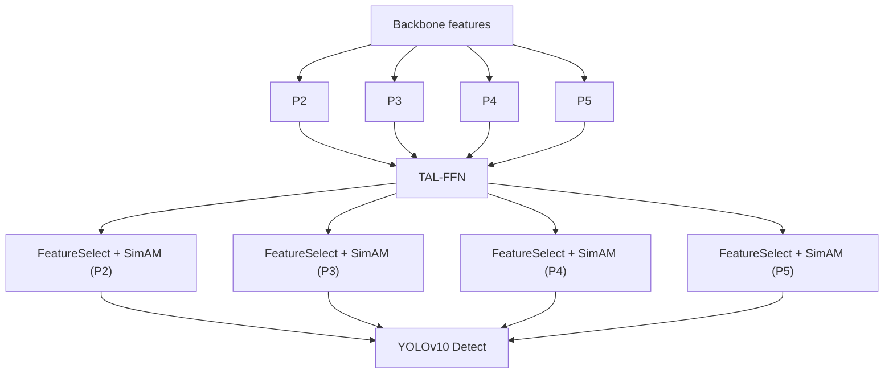

# AgriYOLO

AgriYOLO is a research-oriented object detection repository built on top of the local `ultralytics/` codebase in this project. The main model variant extends YOLOv10 with a lightweight multi-scale fusion neck for small-object detection in agricultural imagery.

The repository includes:

- The custom TAL-FFN neck implementation
- AgriYOLO model YAMLs and ablation configs
- Training, evaluation, benchmarking, and visualization scripts
- A small regression test suite for the architecture fixes applied in this repo

The repository does not include:

- The dataset used in the experiments
- Pretrained project-specific checkpoints
- Final paper-ready artifacts as tracked source files

## Highlights

- Four-scale detection with an explicit P2 head for small objects
- TAL-FFN neck with configurable ADSA, CADFM, and DSConv switches
- SimAM-based per-scale refinement before detection
- YOLOv10-style training path with one-to-many and one-to-one heads
- Utility scripts for ablations, SOTA comparison, speed benchmarking, and plotting

## Architecture

AgriYOLO keeps the YOLOv10 backbone and detection paradigm, then replaces the standard PAN/FPN-style neck with a task-driven fusion block.



Main components:

- `ADSA`: asymmetric depth allocation, giving shallower scales a heavier fusion path
- `CADFM`: context-aware dynamic fusion weighting
- `DSConv`: depthwise separable convolution option inside TAL-FFN
- `SimAM`: lightweight attention applied to each selected feature map

## Repository Layout

```text
.
|-- ultralytics/                   # Local model, trainer, data, and module code
|   |-- cfg/models/v10/            # AgriYOLO and ablation YAML configs
|   |-- engine/                    # Training and validation engine
|   |-- models/                    # YOLO / YOLOv10 wrappers
|   `-- nn/modules/                # Custom layers, head, and TAL-FFN implementation
|-- experiments/                   # Repro scripts for ablation, SOTA eval, and speed tests
|-- scripts/                       # Shell entrypoints for train, val, and benchmark
|-- visualize/                     # Optional plotting and visualization scripts
|-- tests/                         # Regression tests for architecture-level fixes
|-- requirements.txt               # Python dependencies
|-- README.md
`-- README_CN.md
```

Generated outputs such as `runs/`, `logs/`, `results/`, `picture/`, `weights/`, `AgriYOLO_Ablation/`, and `SOTA_Comparisons/` are intentionally ignored by Git.

## Installation

### Requirements

- Python 3.8+
- PyTorch 2.0+
- CUDA-capable GPU recommended for training

### Setup

```bash
git clone https://github.com/DexZane/AgriYOLO
cd yolov10-main
pip install -r requirements.txt
```

Run commands from the repository root so Python imports the local `ultralytics/` package in this workspace.

## Quick Start

### 1. Train AgriYOLO

Use the shell entrypoint:

```bash
bash scripts/train.sh \
  --data path/to/data.yaml \
  --device 0
```

Full training example:

```bash
bash scripts/train.sh \
  --model ultralytics/cfg/models/v10/yolov10s_TAL_FFN.yaml \
  --data path/to/data.yaml \
  --epochs 150 \
  --imgsz 640 \
  --batch 16 \
  --device 0 \
  --project runs/train \
  --name agriyolo
```

Python equivalent:

```python
from ultralytics import YOLOv10

model = YOLOv10("ultralytics/cfg/models/v10/yolov10s_TAL_FFN.yaml")
model.train(
    data="path/to/data.yaml",
    epochs=150,
    imgsz=640,
    batch=16,
    device=0,
)
```

### 2. Validate a Trained Checkpoint

Use the shell entrypoint:

```bash
bash scripts/val.sh \
  --model path/to/best.pt \
  --data path/to/data.yaml \
  --split test \
  --device 0
```

Python equivalent:

```python
from ultralytics import YOLOv10

model = YOLOv10("path/to/best.pt")
model.val(
    data="path/to/data.yaml",
    split="test",
    imgsz=640,
    save_json=True,
)
```

### 3. Run Inference

```python
from ultralytics import YOLOv10

model = YOLOv10("path/to/best.pt")
model.predict(
    source="path/to/images_or_video",
    imgsz=640,
    conf=0.25,
    save=True,
)
```

## Model Configurations

The main configs live under [`ultralytics/cfg/models/v10/`](./ultralytics/cfg/models/v10/).

Important variants:

- `yolov10s_baseline.yaml`: baseline YOLOv10s-style detector used for comparison
- `yolov10s_P2_BiFPN.yaml`: P2 head plus standard BiFPN-style fusion
- `yolov10s_P2_ADSA.yaml`: adds asymmetric depth allocation
- `yolov10s_P2_CADFM.yaml`: adds context-aware dynamic fusion
- `yolov10s_TAL_FFN.yaml`: full AgriYOLO neck with ADSA, CADFM, DSConv, and SimAM

## Reproducibility Scripts

### Ablation Study

```bash
python experiments/ablation_study.py
```

Expected input:

- A valid dataset YAML, currently defaulted to `data/Crop/data.yaml` inside the script

Outputs:

- Training runs under `TAL_FFN_Ablation/`
- Validation artifacts under the same project directory

### SOTA Comparison

```bash
python experiments/run_sota_comparison.py --data path/to/data.yaml --epochs 150 --imgsz 640 --device 0
```

What it does:

- Trains or reuses checkpoints for multiple detector baselines
- Evaluates on the full YOLO `test` split using COCO-style metrics
- Writes summaries to `logs/`
- Generates comparison curves under `picture/`

### Speed Benchmark

```bash
bash scripts/benchmark.sh --device 0 --imgsz 640 --warmup 10 --iterations 50
```

Or call the Python script directly:

```bash
python experiments/speed_benchmark.py --device 0 --imgsz 640 --warmup 10 --iterations 50
```

The benchmark uses raw model forward passes under `torch.inference_mode()` and expects checkpoints to exist under `SOTA_Comparisons/<model>/weights/best.pt`.

## Tests

Run the regression tests with:

```bash
python -m unittest discover -s tests -v
```

The current tests cover:

- TAL-FFN ablation variants being structurally distinct
- SimAM not collapsing to an identity mapping
- YOLOv10 eval mode avoiding the extra one-to-many inference branch
- Full-split COCO ground-truth generation with real image sizes

## Notes on Data and Outputs

- This repository does not ship the training dataset
- The default example paths in some scripts assume a local dataset layout such as `data/Crop/data.yaml`
- Benchmark logs, plots, and checkpoints are generated locally and are gitignored
- If you publish the repository, upload code and configs first, then release weights separately if needed

## Acknowledgements

This project is built on top of the Ultralytics YOLO codebase and adapts it for the AgriYOLO research setting.

## License

This repository is distributed under the GNU Affero General Public License v3.0. The project vendors and modifies code from the local `ultralytics/` codebase, so the repository license must stay compatible with that code.

## Citation

If you use this repository in academic work, cite the repository first and replace it with the final paper citation when available.

```bibtex
@misc{agriyolo,
  title        = {AgriYOLO},
  author       = {Repository Authors},
  year         = {2026},
  howpublished = {\url{https://github.com/DexZane/AgriYOLO/}}
}
```
