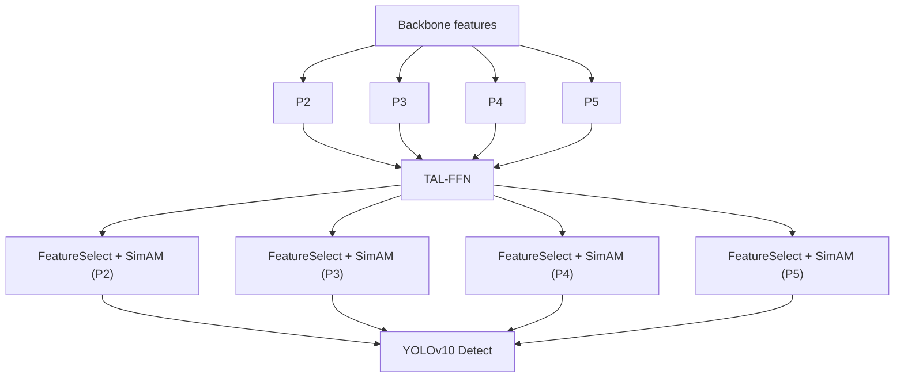

# AgriYOLO

AgriYOLO 是一个面向研究复现的目标检测仓库，基于本项目内置的本地 `ultralytics/` 代码实现。主模型在 YOLOv10 的基础上加入了面向小目标检测的轻量级多尺度特征融合结构。

本仓库包含：

- TAL-FFN 自定义 neck 实现
- AgriYOLO 主模型与消融实验 YAML 配置
- 训练、评估、测速与可视化脚本
- 针对本仓库架构修复的回归测试

本仓库不包含：

- 训练所用数据集
- 项目专用预训练权重
- 本地生成的实验产物与中间结果

## 主要特性

- 显式引入 P2 检测头以增强小目标检测能力
- TAL-FFN 支持 ADSA、CADFM 与 DSConv 开关组合
- 在各尺度输出前加入 SimAM 进行轻量特征增强
- 保持 YOLOv10 风格的训练与检测流程
- 提供消融、SOTA 对比、速度基准和可视化脚本

## 架构概览

AgriYOLO 保留 YOLOv10 的主干和检测范式，并将标准 PAN/FPN 风格 neck 替换为任务驱动的融合模块。



模块说明：

- `ADSA`：非对称深度分配，给浅层尺度更重的融合路径
- `CADFM`：上下文感知动态融合权重
- `DSConv`：深度可分离卷积选项
- `SimAM`：逐尺度轻量注意力增强

## 仓库结构

```text
.
|-- ultralytics/                   # 本地模型、训练器、数据与网络实现
|   |-- cfg/models/v10/            # AgriYOLO 与消融配置
|   |-- engine/                    # 训练与验证引擎
|   |-- models/                    # YOLO / YOLOv10 封装
|   `-- nn/modules/                # 自定义模块、检测头与 TAL-FFN
|-- experiments/                   # 消融、SOTA 对比与测速脚本
|-- visualize/                     # 可视化脚本
|-- tests/                         # 回归测试
|-- requirements.txt
|-- README.md
`-- README_CN.md
```

`runs/`、`logs/`、`results/`、`picture/`、`weights/`、`AgriYOLO_Ablation/`、`TAL_FFN_Ablation/`、`SOTA_Comparisons/` 等目录属于本地生成产物，已经通过 `.gitignore` 排除。

## 安装

### 环境要求

- Python 3.8+
- PyTorch 2.0+
- 建议使用支持 CUDA 的 GPU 进行训练

### 安装步骤

```bash
git clone <your-repo-url>
cd yolov10-main
pip install -r requirements.txt
```

所有命令请在仓库根目录执行，以保证 Python 优先导入当前工作区中的本地 `ultralytics/` 包。

## 快速开始

### 1. 训练 AgriYOLO

```python
from ultralytics import YOLOv10

model = YOLOv10("ultralytics/cfg/models/v10/yolov10s_TAL_FFN.yaml")
model.train(
    data="path/to/data.yaml",
    epochs=150,
    imgsz=640,
    batch=16,
    device=0,
)
```

### 2. 验证训练后的权重

```python
from ultralytics import YOLOv10

model = YOLOv10("path/to/best.pt")
model.val(
    data="path/to/data.yaml",
    split="test",
    imgsz=640,
    save_json=True,
)
```

### 3. 推理

```python
from ultralytics import YOLOv10

model = YOLOv10("path/to/best.pt")
model.predict(
    source="path/to/images_or_video",
    imgsz=640,
    conf=0.25,
    save=True,
)
```

## 模型配置

主要配置位于 `ultralytics/cfg/models/v10/`。

常用配置包括：

- `yolov10s_baseline.yaml`：用于对比的 YOLOv10s 基线结构
- `yolov10s_P2_BiFPN.yaml`：引入 P2 检测头与标准 BiFPN 风格融合
- `yolov10s_P2_ADSA.yaml`：在上一步基础上增加 ADSA
- `yolov10s_P2_CADFM.yaml`：进一步增加 CADFM
- `yolov10s_TAL_FFN.yaml`：完整 AgriYOLO 结构，包含 ADSA、CADFM、DSConv 与 SimAM

## 复现实验脚本

### 消融实验

```bash
python experiments/ablation_study.py
```

默认要求：

- 有效的数据集配置文件，脚本当前默认读取 `data/Crop/data.yaml`

输出位置：

- 训练结果默认写入 `TAL_FFN_Ablation/`

### SOTA 对比

```bash
python experiments/run_sota_comparison.py --data path/to/data.yaml --epochs 150 --imgsz 640 --device 0
```

脚本行为：

- 训练或复用多个检测器基线
- 在完整 `test` 划分上进行 COCO 风格评估
- 将汇总结果写入 `logs/`
- 将对比曲线输出到 `picture/`

### 速度基准

```bash
python experiments/speed_benchmark.py --device 0 --imgsz 640 --warmup 10 --iterations 50
```

该脚本使用 `torch.inference_mode()` 下的原始前向推理，不包含 predictor 侧额外预处理和后处理时间。默认依赖 `SOTA_Comparisons/<model>/weights/best.pt` 下已有权重。

## 测试

运行回归测试：

```bash
python -m unittest discover -s tests -v
```

当前测试覆盖：

- TAL-FFN 消融结构是否真正区分
- SimAM 是否不再退化成近似恒等映射
- YOLOv10 推理时是否避免额外 one-to-many 分支计算
- COCO GT 生成是否覆盖完整 test split 并读取真实图像尺寸

## 数据与产物说明

- 本仓库不附带训练数据集
- 某些脚本默认假设数据配置位于 `data/Crop/data.yaml`
- 基准日志、绘图产物和权重文件都属于本地生成结果，已被 `.gitignore` 排除
- 如果准备公开发布，建议代码仓库与权重发布分离

## 致谢

本项目基于 Ultralytics YOLO 代码库构建，并在此基础上实现 AgriYOLO 的研究原型。

## 许可证

本仓库采用 GNU Affero General Public License v3.0。由于仓库直接包含并修改了本地 `ultralytics/` 代码，因此许可证需要与该部分代码保持兼容。

## 引用

若你在学术工作中使用本仓库，请先引用仓库本身，后续若有正式论文可替换为论文引用。

```bibtex
@misc{agriyolo,
  title        = {AgriYOLO},
  author       = {Repository Authors},
  year         = {2026},
  howpublished = {\url{https://github.com/<user>/<repo>}}
}
```
